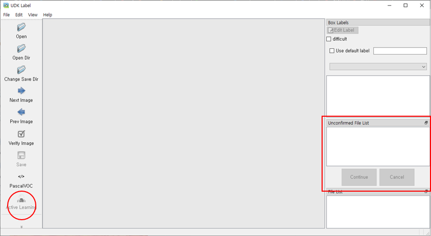

# udk_label

[](https://www.python.org/downloads/release/python-360/)
[](https://www.python.org/downloads/release/python-360/)

Object Detection Task는 객체마다 Bounding Box 처리해주는 이른바 Label작업이 필요합니다. 
작업은 주로 사용자가 수동으로 진행해야했으며, 이는 상당한 시간과 정신을 소모하게 됩니다.

이러한점에 착안하여 Label작업을 자동으로 해주는 **udk_label**를 개발하였습니다.

**udk_label**는 오픈소스 labelImg를 수정하여 개발되었습니다. 
대부분의 UI는 변경된것이 없으며 **active learning** 기반의 AI 엔진이 탑재되어있습니다.
AI 엔진은 Pytorch 기반의 RetinaNet 모델입니다.
*__(때문에 GPU 장치가 있어야 사용가능하며 cuda, cudnn은 필수적입니다.)__*
   
추후에 다양한 AI모델을 추가할 예정에 있으며, UI/UX를 고려한 디자인도 보완해나갈 예정입니다.

## Install

conda, venv 등 가상환경위에서 설치하는것을 추천합니다.

```shell
pip install -r requirements.txt
```

만약 설치 도중 에러가 나는 모듈이 있다면 개별 설치를 진행합니다.

```Shell
pip install torch
pip install torchvision
pip install PyQt5
pip install pycocotools
pip install scikit-image
pip install opencv-python
pip install tqdm
pip install tensorboardX
pip install lxml
```


### Windows

- **[pycocotools]** Visual C++ error: [https://visualstudio.microsoft.com/ko/vs/older-downloads/](https://visualstudio.microsoft.com/ko/vs/older-downloads/) 
에서 *재배포 가능 패키지 및 빌드 도구* 하위 *Microsoft Build Tools 2015 업데이트3* 을 설치해주시기 바랍니다. 

### Ubuntu

- **[opencv]** lib error: 아래의 패키지를 설치해주세요.

```Shell
sudo apt-get install -y libglib2.0-0 libsm6 libxext6 libxrender1 libfontconfig1
```

발생했던 에러에 대해서 Issues에 남겨주시면 case별로 다루도록 하겠습니다.

## How to Use

UI와 기능은 모두 labelImg와 동일합니다. Auto Labeler를 사용하지 않을 경우에는 기존 방법대로 사용할 수 있습니다.

labelImg의 사용법은 원작자의 github를 참고하시기 바랍니다.



### Step

1. 이미지 폴더와 Label이 저장될 폴더를 지정합니다. 반드시 이미지와 Label파일의 폴더구조가 아래와 같이되도록 설정해야만 합니다. 
   
   ```text
   root_dir/
       | --- Image/
       |      |-- 0001.jpg
       |      |-- 0002.jpg
       |      |-- 0003.jpg
       |      |-- ...
       |
       | --- Label/
       |      |-- 0001.xml
       |      |-- 0002.xml
       |      |-- 0003.xml
       |      |-- ...
   ```
   
2. 사용자가 직접 Label작업을 진행합니다. 초기에 얼마나 많이 Labeling 되어있는지에 따라 작업 속도와 성능에 차이를 주기 때문에 
   전체이미지 대비 10% 또는 100장 이상의 이미지에 대하여 Label을 진행하는것을 추천합니다.
   
3. 활성화된 Active Learning 버튼을 누릅니다. 우측 하단에 상태바에 학습과 추론의 진행상황이 표시됩니다.

4. 완료가 되면 Unconfirmed File List에 100장의 이미지 목록이 나타납니다.
   사용자는 해당 이미지에 대해서 다시 Label 작업을 진행합니다. 작업이 완료되면 Continue 버튼을 누릅니다. 
   우측 하단에 상태바에 학습과 추론의 진행상황이 표시됩니다. 

5. 4번 과정을 반복해서 진행합니다.
   
6. 반복작업이 어느정도 진행되었다고 판단이 되면 Stop 버튼을 누릅니다. 
   그러면, Label 작업을 하지 않은 나머지 이미지에 대해서 모두 Auto Label을 진행합니다.
   
## Concept


## References

- [tzutalin/labelImg](https://github.com/tzutalin/labelImg)
- [yhenon/pytorch-retinanet](https://github.com/yhenon/pytorch-retinanet)
- [victoresque/pytorch-template](https://github.com/victoresque/pytorch-template)
- [active_learning](https://www.datacamp.com/community/tutorials/active-learning)